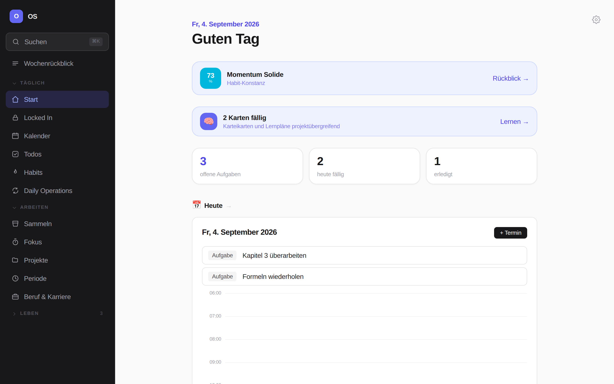
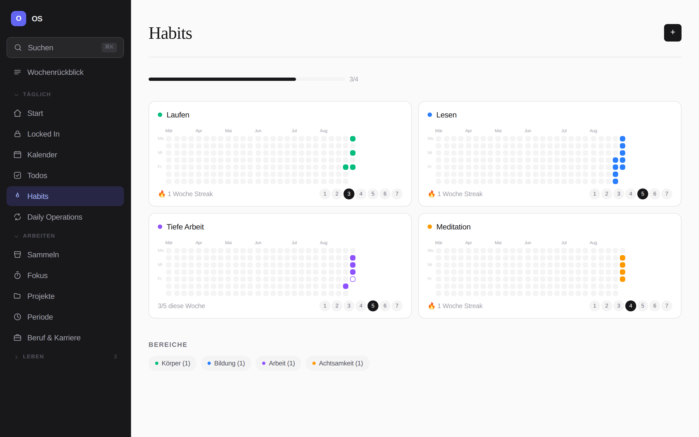
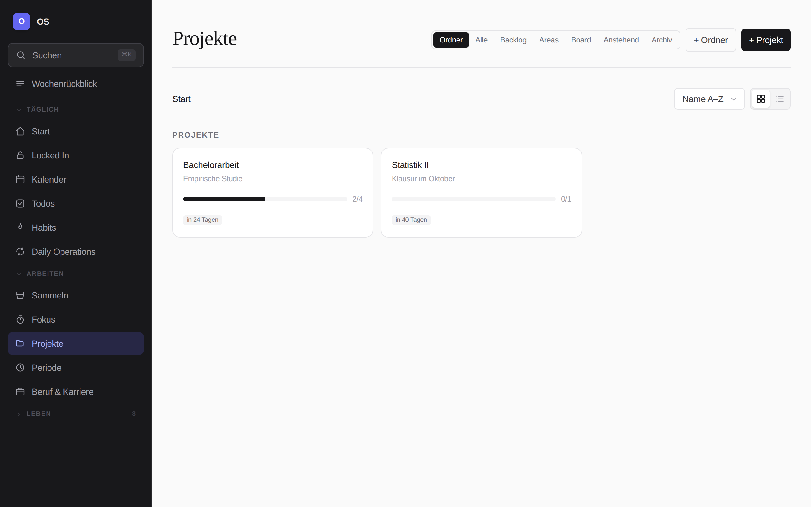
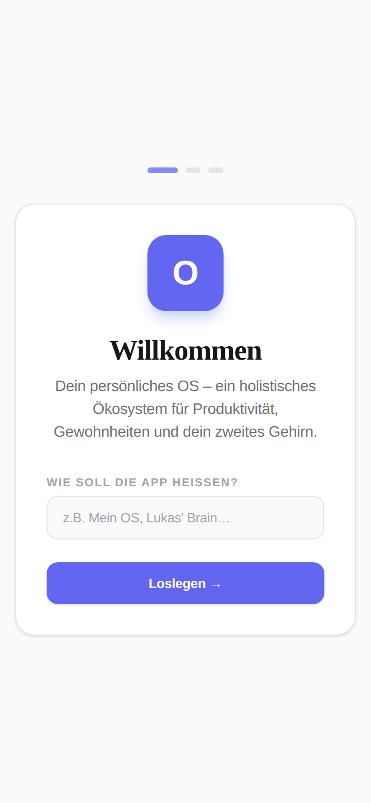

# OS

Ein persönliches „Betriebssystem" für Studium, Projekte und Alltag: Kalender,
Todos, Habits, Fokus-Timer, Projekte mit Notizen und Karteikarten, Finanzen,
Wochenrückblick – in einer App, die sich auf das reduzieren lässt, was man
wirklich nutzt.

Die App ist eine reine Web-App (React + Vite). Sie läuft ohne Konto und ohne
Server; alle Daten liegen im Browser. Wer will, schaltet zusätzlich einen
Login mit Cloud-Sync frei (Supabase) und hat denselben Stand auf allen
Geräten.



| Habits | Projekte | Unterwegs |
| --- | --- | --- |
|  |  |  |

*(Screenshots mit Beispieldaten)*

---

## Schnellstart

```bash
npm install
npm run dev      # Entwicklung, http://localhost:5173
npm run build    # Produktions-Build nach dist/
npm run preview  # gebauten Stand lokal ansehen
npm run lint     # Oxlint
npm test         # Vitest (Logik in src/lib)
npm run test:e2e # Playwright (Oberfläche, gegen den Produktions-Build)
```

Ohne weitere Einrichtung startet die App im lokalen Modus: kein Login, keine
Cloud, Daten nur auf diesem Gerät.

## Was drin ist

| Bereich | Inhalt |
| --- | --- |
| **Start** | Tagesüberblick in sechs wählbaren Stilen (Todo-Liste, Gamified, Terminal, Clean Girl, Notion, Locked In) – der Stil prägt Start, Todos und Habits |
| **Locked In** | Kompromissloser Fokus-Modus: ein Ziel, eine Phase, nur das Nötigste – solange er läuft, ist die ganze App monochrom |
| **Kalender** | Tages-, Wochen- und Monatsansicht, Tagesblöcke, ICS-Export |
| **Todos** | Eisenhower-Matrix, Dauer, Deadlines, Projektzuordnung |
| **Sammeln** | Notizen in Ordnern, Tags, `[[Wikilinks]]` und Graph-Ansicht |
| **Habits** | Gewohnheiten mit Wochenzielen, Streaks, Bereichen und Habit-Stacking |
| **Fokus** | Pomodoro-Timer mit Sessions-Protokoll |
| **Projekte** | Ordner, Areas, Board, Blatt-Ansicht mit Blöcken, Workflow, Vorlagen |
| **Lernen** | Lernpläne und Karteikarten mit Spaced Repetition |
| **Periode** | Fokus-Perioden (14/30/90 Tage, Halbjahr, Jahr) mit Wochenzielen |
| **Finanzen** | Konten, Budgets, Ausgaben, Sparziele, CSV-Import |
| **Beruf & Karriere** | Bewerbungs-Pipeline mit Fristen, Karriereziele, Weiterbildung |
| **Alltag** | Routinen als Checklisten mit Rhythmus, Tagesbilanz und Serie – dazu der tägliche Körper-Check-in |
| **Leisure & Kultur** | Medienbibliothek: Filme, Serien, Bücher & mehr |
| **Wochenrückblick** | Wochenabschluss mit Statistik und Mentor-Hinweisen |

Welche Bereiche erscheinen, legt der Einrichtungsassistent über ein Profil
fest – jederzeit änderbar unter *Einstellungen → Profil / Navigation*.

## Daten

Alle Daten liegen in `localStorage`, jeder Bereich unter einem eigenen
Schlüssel (`todos`, `habits`, `projekte` …). Der gemeinsame Zugriff läuft über
den Hook `useStored` (`src/lib/useStored.js`): Alle Komponenten mit demselben
Schlüssel sehen Änderungen sofort.

Unter *Einstellungen → Daten* gibt es einen vollständigen JSON-Export und den
passenden Import (Backup und Umzug auf ein anderes Gerät).

## Geräte koppeln (iPhone ↔ Mac ↔ …)

Mit Supabase synchronisiert die App ihren kompletten Zustand live zwischen
allen angemeldeten Geräten:

1. **Supabase-Projekt anlegen** auf [supabase.com](https://supabase.com) (kostenlos).
2. **Datenbank einrichten:** Im Dashboard → *SQL Editor* den Inhalt von
   [`supabase/schema.sql`](supabase/schema.sql) einfügen und *Run* klicken.
   (Legt die Tabelle `app_state`, die Sicherheitsregeln und Realtime an.)
3. **Zugangsdaten eintragen:** `.env.example` nach `.env.local` kopieren und
   `VITE_SUPABASE_URL` + `VITE_SUPABASE_ANON_KEY` aus *Project Settings → API*
   einsetzen. Beim Deployment dieselben zwei Werte als Umgebungsvariablen
   hinterlegen.
4. **Auf beiden Geräten mit demselben Account anmelden** (E-Mail + Passwort).
   Beim ersten Mal einmal *Registrieren* und den Bestätigungs-Link in der
   E-Mail anklicken – danach auf jedem weiteren Gerät nur noch *Anmelden*.

Fertig: Was du auf dem Mac änderst, erscheint sofort auf dem iPhone – und
umgekehrt. Ohne Supabase-Werte läuft die App weiter im lokalen Modus.

## Deployment

* **Vercel:** `vercel.json` ist hinterlegt (Vite-Build, SPA-Rewrite). Nur die
  beiden Supabase-Variablen unter *Settings → Environment Variables* ergänzen.
* **GitHub Pages:** `.github/workflows/deploy.yml` baut und veröffentlicht bei
  jedem Push auf `main`. Die Supabase-Werte kommen aus den Repository-Secrets;
  fehlen sie, entsteht ein Build im lokalen Modus.

Der Build nutzt `base: "./"`, läuft also auch unter einem Unterpfad
(`username.github.io/OS/`). Als PWA lässt sich die Seite auf dem iPhone über
*Teilen → Zum Home-Bildschirm* installieren.

**Offline:** Ein Service Worker (`vite-plugin-pwa`) legt den gebauten Stand in
den Cache – nach dem ersten Besuch startet die App auch ohne Netz, die Daten
liegen ohnehin lokal. Eine neue Fassung wird im Hintergrund geholt und beim
nächsten Öffnen aktiv; der Versions-Stempel unten in den Einstellungen zeigt,
welcher Stand gerade läuft. Nicht im Cache liegen die dekorativen Schriften von
Google Fonts – ohne Netz greifen dort die System-Schriften.

## Tests

`npm test` prüft die Logik in `src/lib` mit Vitest – Datumsrechnung, Habit-
Streaks und Disziplin, Spaced Repetition, Wochenbericht, Finanz-Auswertungen,
Projekt-Fortschritt, Eisenhower-Einteilung, Termin-Wiederholungen, Routinen-
Rhythmus und -Serie, Bewerbungs-Pipeline, Tags und Wikilinks sowie die
Einstellungs-Vorgaben. Die Oberfläche selbst ist nicht
abgedeckt; sie hängt an denselben Funktionen.

`npm run test:e2e` fährt zusätzlich den Produktions-Build hoch und klickt ihn
mit Playwright durch: Einrichtung, alle Bereiche öffnen, Todo mit Datums-
Erkennung anlegen, Routine abhaken (inklusive Startseite und Neuladen),
Bewerbung durch die Pipeline schieben, jeden der sechs Stile auf Start, Todos
und Habits – und ein Durchlauf mit abgeschaltetem Netz, der prüft, dass die
App offline startet.

Der Workflow auf GitHub führt vor jedem Deployment `npm run lint`, `npm test`,
`npm run test:e2e` und `npm run build` aus.

## Aufbau

```
src/
  App.jsx          Navigation, Routing, einmalige Daten-Migrationen
  components/      Seiten und Bausteine (eine Datei pro Bereich)
  lib/             Logik ohne Darstellung: Rechnungen, Speicher, Konstanten
  index.css        Tailwind + Akzentfarben als CSS-Variablen
e2e/               Oberflächen-Tests (Playwright)
supabase/          SQL-Schema für den Sync
```

Faustregel: `components/` zeigt an, `lib/` rechnet. Was zwei Seiten teilen,
gehört in `lib/`.

Die Versionsnummer in den Einstellungen kommt aus der `package.json`, das
Datum daneben aus dem Build (`vite.config.js` → `src/lib/version.js`).

## Technik

React 19 · Vite 8 · Tailwind CSS 4 · Oxlint · Supabase (optional)
